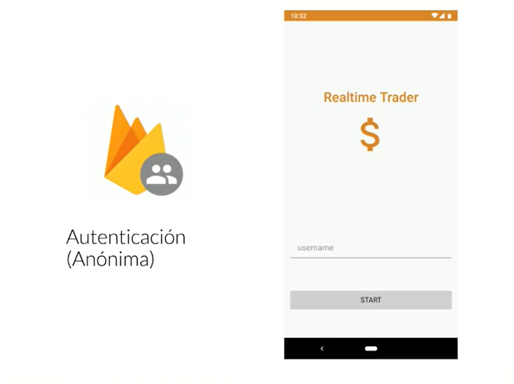
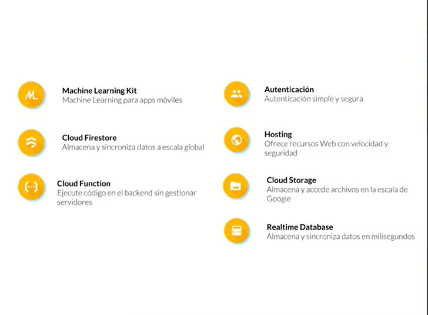
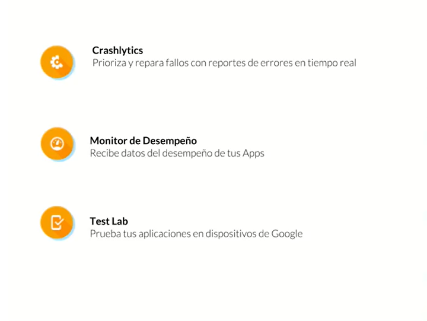
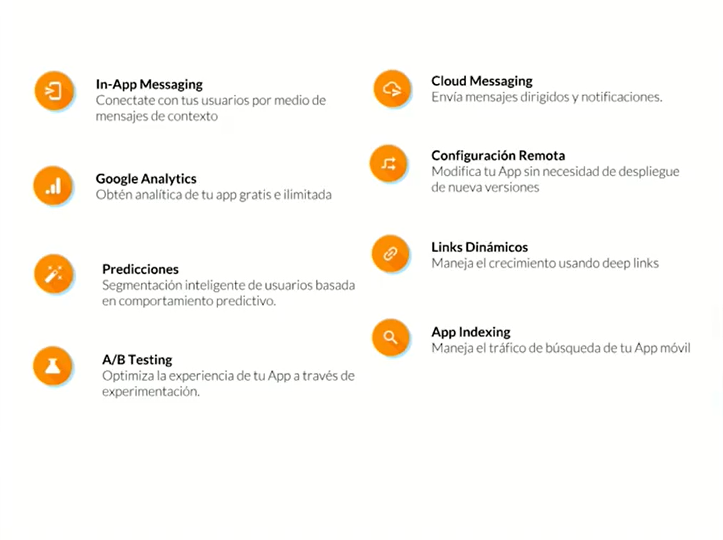

# Apuntes de Firebase Firestore con Kotlin

Firebase es una herramienta diseñada para desarrolladores móviles, la cual nos hace despreocuparnos completamente de la infraestructura, nos permite enfocarnos en el producto ofreciéndonos servicios que nos garantizan escalabilidad.

En este curso vamos a usar dos módulos de **Firebase, el modulo de Autenticación y el modulo de Cloud FireStore**.

## Modulo de Autenticación

Nos permite crear cuentas temporales las cuales pueden acceder a los datos que están protegidos con reglas de seguridad.

## Modulo de Cloud FireStore

Nos da una base de datos en tiempo real, sincronizada, no relacional y que es flexible a escalar a las diferentes configuraciones que queramos.

## Proyecto

En este caso construiremos una aplicación de criptomonedas la cual actualizara en tiempo real un dashboard.

## Firebase

La premisa que nos ofrece es **"aplicaciones rápidas sin preocuparte de infraestructura"**, esto se puede configurar de manera muy sencilla, en el curso vamos a utilizar estos módulos y con muy pocas lineas de código vamos a poder acceder y empezar a interactuar con **Firebase**.

Adicionalmente vas a crear mejores aplicaciones, te vas a enfocar mas en tu producto y esto va a hacer que tu productividad aumente no teniendo que preocuparte por toda la complejidad que conlleva configurar un backend y hacer que este escale.

## Otros módulos de Firebase

### Apps de Mayor Calidad

Las mediciones son muy importantes cuando desarrollas un producto de software para esto nos ofrecen diferentes herramientas para que podamos medir cual es la interacción que los usuarios tienen con nuestra aplicación. Para eso tenemos:

**Crashlytics** para medir todo tipo de fallos en las aplicaciones y priorizarlos.

**Monitor de Desempeño** el cual recibe todo los datos del desempeño de la aplicación.

**Test Lab** para probar nuestra aplicación en dispositivos reales lo cual es muy importante.

### Crece tu Negocio

Aquí queremos mirar todo el comportamiento de la aplicación y cómo lo podemos ajustar.

