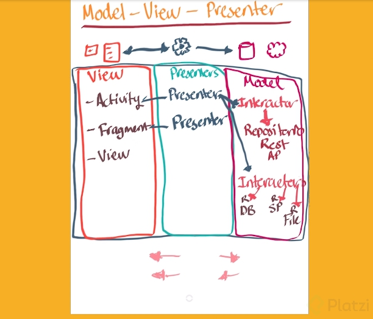
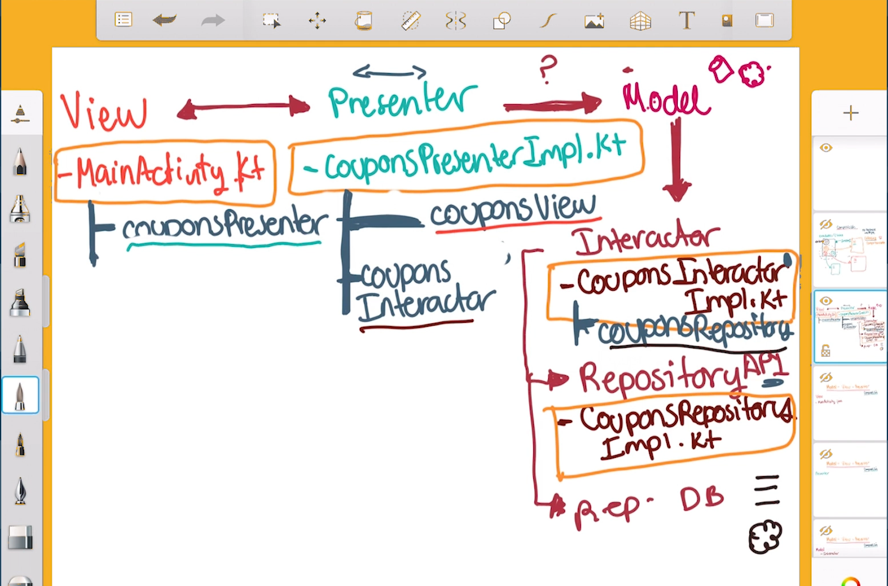
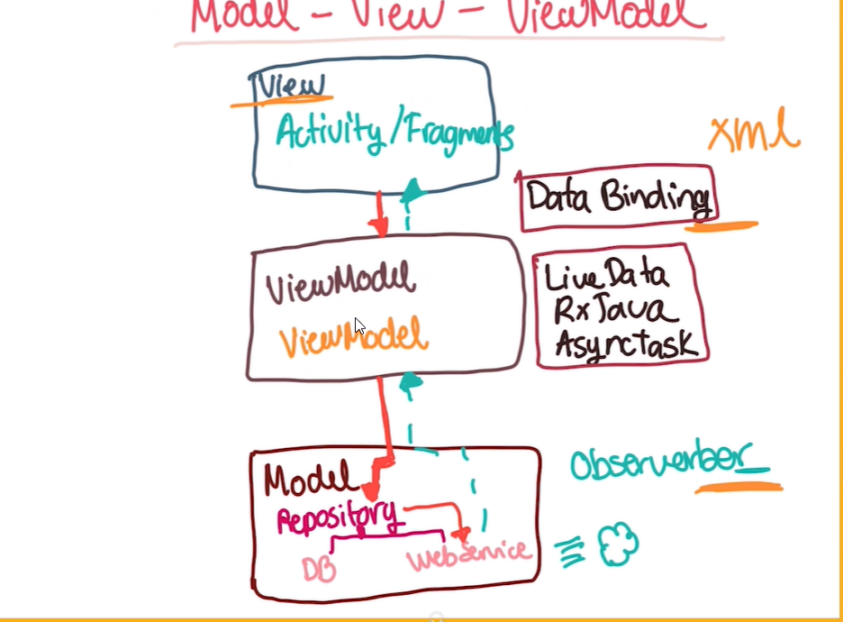

# Notas Arquitectura Android

Las aplicaciones móviles han dejado de ser simples y esto es porque proyectos más robustos nacen de la idea de **Mobile First**. Por lo general este tipo de proyectos grandes tienen la limitante del tiempo de desarrollo por lo que pueden convertirse en una pesadilla sino son bien diseñados.

**Deuda Técnica**: Es ese esfuerzo adicional causado por la elección de un desarrollo sencillo. Un desarrollo que no tiene una estructura pensada y analizada, no tiene una arquitectura adecuada al objetivo del proyecto.

Las aplicaciones móviles en general nos exigen mucho, los usuarios nos exigen que la aplicación sea:

- Rápida
- Fluida
- Segura
- Mantenible

## Patrón de diseño vs. Arquitectura de Diseño

La **arquitectura** en general no solo podemos usarla en una aplicación móvil sino que deberíamos aplicarla a cualquier proyecto de software.

**Patrón de Diseño**: Un **patrón** es un modelo que sirve de muestra para sacar otra cosa igual. Los patrones de diseño son una solución a problemas comunes de código reutilizable.

- Organiza un componente o elemento de la aplicación

Algunos Patrones de diseño conocidos:

- Singleton
- Adapter
- Builder
- Factory

**Arquitectura de Diseño**: La **arquitectura** es el arte y técnica de diseñar, proyectar y construir. Una Arquitectura de Diseño proporciona la estructura, funcionamiento e interacción entre las partes del software.

Algunas Arquitecturas conocidas:

- **MVC** : Model-View-Controller
- **MVP** : Model-View-Presenter
- **MVVM** : Model-View-ViewModel

## ¿Qué es la Arquitectura de Diseño?

Una **arquitectura** nos proporciona una estructura, se va a encargar del buen funcionamiento y una buena interacción entre las partes del software.

**Modelo de capas (Layers Model)**. La arquitectura va a estar orquestando lo que sucede a nivel de aplicación. Ahora vamos a organizarlo en capas, módulos o partes del software:

- **UI o Presentación** : Encontraremos todo lo que tiene que ver con la interfaz de usuario: botones, imágenes, campos de texto y más.

- **Business Logic o Reglas de Negocio** : Encontraremos toda la lógica de lo que tiene que hacer la aplicación, los casos de uso de la aplicación: login, logout, registrar usuarios y más.

- **Data** : Veremos mucho sobre la persistencia y procesamiento de la información, la mayoría de las aplicaciones deben estar preparadas para soportarlo: leer una base de datos o traer datos de una API.

**Arquitecto de Software** : Va a analizar las necesidades, va a planear con anticipación, toman decisiones para evitar riesgos y tienen una amplia experiencia resolviendo problemas.

**El futuro tú** tendrá que reutilizar código creado por otro desarrollador, tocar código creado por ti de hace mucho tiempo, resolver bugs e implementar nuevos features.

En conclusión la Arquitectura de Diseño:

- Organiza el código para trabajar en equipo.
- Hace el código más intuitivo de leer y escribir.
- Permite mantener, testear e integrar nuevos features más rápido y fácil.

## SOLID: Single Responsability y Open/Closed Principles

**SOLID Principles**: La palabra **SOLID** es un acrónimo y cada una de sus letras representa un principio. Básicamente es un set de diseño que en general es de lo más popular a la hora de implementar una arquitectura en nuestro proyectos

- **S**ingle Responsability: Buscamos que una clase tenga una sola responsabilidad.
  
- **O**pen/Closed Principle: “Las entidades: clases, módulos, interfaces, etc. Deben estar abiertas por extensión pero cerradas para modificación”. Utilizar interfaces en este principio es de las mejores prácticas, buscamos que las funcionalidades de una entidad estén separadas y los parámetros o atributos también estén separados.

### SOLID: Liskov substitution, Interface segregation y Dependency Inversion principle

- **L**iskov Substitution: **Deberíamos poder usar una clase hija para sustituir a una clase padre sin obtener errores**.
  
Por ejemplo, cuando creamos una array, en Java sería:

```java
List<Integer> nums = new ArrayList<>();
```

ArrayList implementa List (una interfaz o padre), por lo tanto al llamar los metodos de list estaremos llamando a los metodos implementados en ArrayList.

- **I**nterface segregation: **Si una interfaz crece demasiado pierde su objetivo y viola el primer principio**.

```java
public interface OnClickListener {
    void onClick(View v);
    void onLongClick(View v);
    void onTouch(View, MotionEvent event); //Según el principio este metodo no deberia estar en la interface
}
```

Por ejemplo, una interfaz ‘Television’ no debería tener un método llamado ‘transmitirEn(Laptop)’.

- **D**ependency Inversion: **Depende de una abstracción, no de algo concreto**.

Por ejemplo, en vez enviar por parámetro un objeto específico (ej: new Corporacion(Ingeniero ing) ), debemos enviar un objeto más abstracto para que nuestra funcionalidad no este conectada a un tipo específico ya que esto puede causar problemas a la hora de arreglar bugs o añadir más features.

## Evolución de la Arquitectura en Android

**MVC (Model-View-Controller)**: Es donde teníamos todas las responsabilidades y todas las acciones de la aplicación en una sola clase, la clase activity (main.Activity).

**MVP (Model-View-Presenter)**: Separa las capas de modelo donde vamos a tener todas las conexiones. Después tenemos un presentador; es la capa donde mantiene la comunicación entre el modelo de datos y la user interface. Después esta arquitectura tuvo una evolución, donde se decidió que deberíamos seguir los principios de la arquitectura limpia, la cual nos dice que debemos exponer las entidades y que las entidades deben ser lo mas importante de la aplicación, mas allá de todas las capas que estén por debajo.

**MVVM (Model-View-ViewModel)**: en la vista tenemos activities y/o fragments, despues en la capa de view model vamos a tener clases que funcionen en un hilo adicional de la aplicación para eso vamos a tener clases como : AsyncTask, Rxjava y LiveData. Y por ultimo esta la capa de model que aqui vamos a tener toda la interacción con una base de datos para conectarla y hacer que los datos lleguen a la user interface.

**Android Jetpack**: Arquitectura de componentes(network resources).

## ¿Qué es la aquitectura Model View Controller (MVC)?

MVC fue la primera arquitectura con la cual empezó todo. Es importante conocerla en caso de que te encuentres con ella y sepas cómo migrar hacía una mejor arquitectura.

El **Model** tendrá la conexión a una base de datos o una API, es donde estan las entidades y los accesos a datos.

El **View** se va a componer de nuestra interfaz: botones y campos de texto, es donde estan los .xml como main_activity.xml.

El **Controller** será toda la lógica de negocio. Puede tener la lógica de lo que realizará un botón, es la clase que "infla" la vista el MainActivity.kt, poner la logica de negocio en esta clase no es recomendable.

Ambos elementos estarán definidos en un solo lugar.

## ¿Qué es la aquitectura Model View Presenter (MVP)?

Esta arquitectura resuelve varios detalles que se presentan cuando tienes una aplicación con **MVC**. No toda la responsabilidad debe caer en nuestro **MainActivity** porque esto podría ocasionar errores de fluidez haciéndola colapsar al haber un proceso pesado en el hilo principal de la aplicación.

**MVP** organiza mejor la distribución de archivos y define las responsabilidades de otra forma.

**Model** (Dos componentes): interactor y repositorio. El interactor decide que tipo de fuente de datos se va utilizar. Hay varios tipos de repositorios
uno puede ser una APIRest, BD, sharedPreferences.

**View**: Activitys, fragments, view. La vista no tiene conocimiento de los modelos.

**Presenter**:  Para cada activity o fragment, hay un presenter. Se encarga de recibir lo que la vista le solicite, primero pasando por el interactor.



## Composición en Clases

Nos permite extender funcionalidades hacia una clase en particular, de interfaz a clase y no de clase a clase.

Entidades/clases: contienen ciertos atributos y comportamientos.

En la composición se abstraen las funcionalidades a traves de una interfaz. En la clase se conservan las propiedades o atributos, en cambio las funcionalidades se declaran en la interfaz. De esta manera se puede reutilizar el comportamiento que ofrece la interfaz, en otras clases.

## Model View Presenter explicado

### Diagrama de Model View Presenter



### Estructura de View


### Estructura de Presenter


### Capa Model


## ¿Qué es Clean Architecture?

El término **Clean** se refiere a las buenas prácticas que se puede tener sobre cierto elemento en la programación.

- Clean Code
- Clean Architecture

**Clean Code** va a referirse a la forma en cómo hacemos que el código sea lo más limpio posible, para ello hay muchas buenas prácticas que van desde el cómo se nombran las variables, la forma en cómo construimos funciones, cómo comentamos el código, la alineación, la abstracción de objetos y estructuras, etc. todo esto con el fin de hacer el código mucho más entendible en el presente y futuro, testeable y fácil de integrar.

### Clean Architecture

En esta ocasión hablaremos sobre Clean en la Arquitectura de software especialmente en Android.

El principal objetivo de una Arquitectura limpia es la capacidad de separar el código en su diferentes responsabilidades.

¿Recuerdas las 3 capas básicas del modelo de capas que te presenté anteriormente?

- Presentation Layer
- Business Logic Layer
- Data Layer

Estas son las tres responsabilidades base sobre las cuales trabaja la arquitectura limpia.

Clean Architecture es un término introducido por Rober C. Martin mejor conocido como **Uncle Bob** o el Tío Bob. Él recopiló los modelos de capas más utilizados en una versión mejorada a la que llamó **Clean Architecture**.

A continuación te presento 5 principios sobre los cuales se basó:

1. **Es independiente de cualquier framework**. La arquitectura limpia debe ser capaz de aplicarse a cualquier sistema sin importar el lenguaje de programación o las librerías que utilice. Las capas deben quedar tan bien separadas que pueden sobrevivir individualmente sin necesidad de externos.
2. **Testeable**. Entre más pura sea una función, clase, módulo etc. más  fácil será predecir el resultado a obtener. Cuando hablamos de que algo sea puro nos referímos a que no tenga efectos colaterales. Cada módulo tanto UI, base de datos, conexion API Rest, etc. debe ser capaz de ser testeado individualmente.
3. **Independiente de la interfaz de Usuario**. Uno de los componentes que sufren cambios más constantemente es la intefaz de usuario, la UI debe ser capaz  de cambiar sin alterar todo el sistema y si vamos más allá, esta capa debería vivir tan independiente que podría ser desensamblada y ser sustituída por otra. Por ejemplo. Cambiar una UI Móvil por una en modo consola.
4. **Independiente de la base de datos**. Así como el punto anterior, esta capa debe ser tan modular que es posible agregarle múltiples fuentes de datos, e incluso multiples fuentes del mismo tipo de datos. Por ejemplo, manejar varias bases de datos: MySQL, PostgreSQL, Redis, etc.
5. **Independiente de cualquier elemento externo**. Si en algún punto nuestro sistema necesita de una librería, otro sistema o cualquier otro elmento a conectar, debería ser fácilmente ensamblado y también debería ser modularizado. De hecho para el sistema esta capa externa debería ser transparente.

Estos principios fueron graficados por el Tio Bob en el siguiente diagrama:


Y si quisiéramos hacer encajar las tres capas que mencionamos arriba se vería así:


El nivel de acceso se dará a partir de las capas externas hasta llegar a las internas como se muestra a continuación:


### Ahora expliquemos cada elemento

En realidad en este punto nosotros ya tenemos experiencia con la separación de capas, de hecho ya aplicamos dos arquitecturas MVC y MVP para  hacerlas Clean subdividiremos un poco más pero  eso lo veremos más adelante, ahora solo quiero explicarte cada elmento a modo de recordatorio:

1. **Entities** Las entidades son los modelos definidos que interactuarán en el sistema. Estas deben ser lo suficientemente abstractas para ser usados por múltiples aplicasciones en el negocio.
2. **Uses Cases(Casos de uso)**. Aquí se contienen las reglas que le dan sentido a la aplicación, los casos de uso dirigen el flujo a las entidades y las orquestan para cumplir con el negocio.
3. **Repositories y Presenters. Interface Adapters**. Esta es la capa intercesora que convierte los datos extraídos por la interfaz de usuario y la capa de datos en el formato más conveniente para los casos de uso.
4. **UI y Data Source. Frameworks y Drivers**. En esta capa van todos los detalles tanto para  mostrar datos en la UI como para obtener los datos requeridos.

## ¿Qué es la arquitectura Model View ViewModel (MVVM)?

En general la arquitectura MVVM es diferente a MVP porque en esta arquitectura vamos a necesitar que los datos se estén manejando de una forma más automatizada y mucho más real time. Podemos usar varias versiones MVVM, una de ellas es **data binding** que es de las más antiguas y existen en muchos otros frameworks como .NET de Microsoft. También tenemos a **Live data** y **RxJava** o **RxAndroid** que son características de la programación reactiva que podemos utilizar para hacer la actualización de datos en tiempo real.



MVVM(Model-View-View-Model): Practicamente es un patron de arquitectura, se divide en 3 secciones:

- Logica de negocio: que es nuestro modelo donde hay objetos
- Logica de presentacion o viewModel: este es un intercomunicador para la interfaz de usuario y los datos que tengamos o el modelo
- Interfaz de usuario: Es toda la vista para el usuario

## ¿Cómo funciona MVVM Data Binding?

Android Data Binding es una biblioteca de soporte que nos permite vincular los componentes de la interfaz de usuario a las fuentes de datos de forma declarativa en lugar de mediante programación, es potencialmente realmente potente y complejo, pero si se usa de manera efectiva, puede reducir la capacidad de presentación.


LiveData es una clase de retención de datos observable. A diferencia de una clase observable regular, LiveData está optimizada para ciclos de vida, lo que significa que respeta el ciclo de vida de otros componentes de las apps, como actividades, fragmentos o servicios. Esta optimización garantiza que LiveData solo actualice observadores de componentes de apps que tienen un estado de ciclo de vida activo.