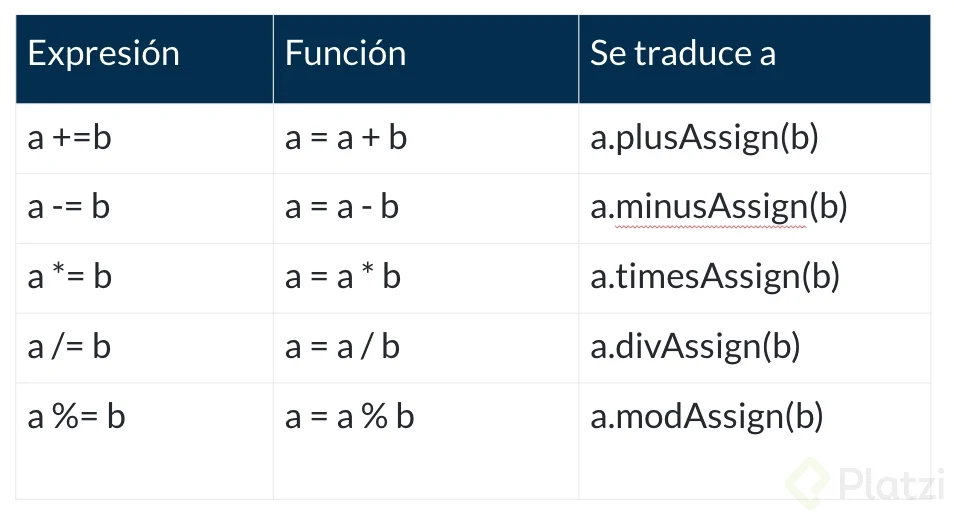
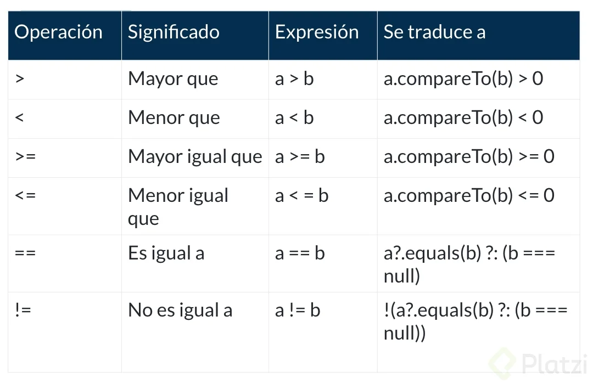
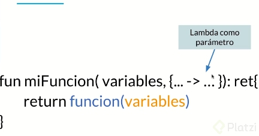

# Notas Kotlin

## ¿Por qué debo aprender Kotlin?

Kotlin es uno de los lenguajes oficiales que Google ha adoptado como parte de la familia de lenguajes de programación para desarrollar con Android. Kotlin fue desarrollado desde el año 2010 gracias a JetBrains y su primera versión fue liberada en el año 2016.

Kotlin es:

**Conciso**: reduce código a diferencia de Java.

**Seguro**: Kotlin tiene un método para evitar las excepciones así como para manejar las NullPointerException.

**Interoperable**: Kotlin al ser creado por JetBrains lo decidieron hacer basado en la máquina virtual de Java, es decir puedes trabajar con Java y Kotlin en una aplicación ya que comparten la misma máquina virtual.

**Versátil**: podemos aplicarlo en diferentes tipos de aplicaciones. Del lado del servidor con Kotlin Server Side - Ktor, del lado Mobile Android y del lado web con KotlinJS.

**Java usa javac y Kotlin usa kotlinc** ambos al ser compilado se transforman en código **ByteCode** que es el código que lee la máquina virtual de Java (Java Virtual Machine).

## Hola mundo en Kotlin

```kotlin
fun main (args: Array<String>) {  
    println("Hola Mundo")  
}
```

## Variable v/s Objetos

En **Kotlin** variables vs. objetos significa otra cosa en comparación a otros lenguajes de programación.

Una **variable** es un espacio en memoria que nosotros reservamos para almacenar un solo dato.

Un **objeto** es un espacio en memoria que es más complejo que una variable, se va a componer de otras variables y otros objetos, acciones, métodos y funcionalidades.

En **Kotlin** todo será un objeto, evitaremos el tipo de datos variables, simples o sencillos (tipos primitivos). No debemos declarar valores primitivos (si podríamos pero no debemos), pero son definidos cuando no los usamos como objetos.

Ejemplo de dato primitivo:

```kotlin
var i = 10
i = i * 2
println(i)
```

**Kotlin** utiliza wrappers (clases envoltorio) para los números, esto se llama boxing.

En los operadores de Kotlin debemos tratar todo como si fuera un objeto:

| Expresion | Función   | Se traduce a     |
| :-------: | :-----:   | :----------:     |
| a + b     | plus      | a.plus(b)        |
| a - b     | minus     | a.minus(b)       |
| a * b     | times     | a.times(b)       |
| a / b     | div       | a.div(b)         |
| a % b     | mod       | a.mod(b)         |
| a += b    | a = a + b | a.plusAssign(b)  |
| a -= b    | a = a - b | a.minusAssign(b) |
| a *= b    | a = a * b | a.timesAssign(b) |
| a /= b    | a = a / b | a.divAssign(b)   |
| a %= b    | a = a % b | a.modAssign(b)   |

-----------------------------------------------------

| Operador | Significado  | Expresión | Se traduce a   |
| :------: | :---------:  | :-------: | :----------:   |
| +        | Suma unaria  | +a        | a.unaryPlus()  |
| -        | Resta unaria | -a        | a.unaryMinus() |
| !        | Negacion     | !a        | a.not()        |
| ++       | Incremento   | ++a       | a.inc()        |
| --       | Decremento   | --a       | a.dec()        |

-------------------------------------------------------

- Wrappers.- Son clases que empaquetan o “envuelven” tipos primitivos, es decir, los tipos de datos pasan de ser de tipo por valor a tipo por referencia. Entendiendo tipo por referencia como una clase.
- Boxing.- Es la estrategia en código de convertir una variable en un objeto. Para conocidos, es como hacer un cast a una variable para que se convierta a un objeto de una clase.

------------------------------------------------------

Todo en **Kotlin** es un **objeto**.

------------------------------------------------------

## Otros Operadores en Kotlin

Cuando usamos un operador en Kotlin él compilador lo traduce a una función específica.
En la tabla que estás mirando te muestro la traducción que usa el compilador para ejecutar la operación.

### Asignacion
------------------------------------------------------


### Unarios, Incremento y Decremento
------------------------------------------------------


### Equidad
------------------------------------------------------


------------------------------------------------------

Hagamos algunos ejemplos para entender cómo funcionan.

Los de asignación son sencillos de entender, basta con la explicación y el desglose que se proporciona en la tabla.

Los operadores unarios no harán más que seguir y tratar de aplicar la regla de los signos, en este caso puedes aplicar el operador o utilizar el método al cual Kotlin lo traduce. Algo así:

```kotlin
var a = -2
var b = a.unaryMinus()
println("b : $b")
```

Esto imprimirá:

- b: 2

Lo que hace es convertir el dato a positivo, pues siguiendo la regla de los signos (-) por (-) es (+).

El operador de negación, funcionará con datos lógicos, este simplemente negará el dato establecido.

```kotlin
var a = true
var b = a.not()
println("b : $b")
```

El resultado será:

- b: false

Al utilizar datos lógicos, la función not() no será la única que podemos usar, tenemos otras opciones como se muestra en la figura:


**El operador incremento y decremento**. Este se dedicará a incrementar o decrementar el valor de la variable en 1. Aquí ocurrirán dos momentos en que se puede incrementar o decrementar la variable, estos se llamarán: Pre-Incrementar a o Post-Incrementar a y Pre-Decrementar --a y Post-Decrementar a–.


Los operadores de equidad se enfocarán en comparar si un dato es igual, o mayor, o mayor e igual que otro, etc. su resultado será un valor lógico. Estos pueden ser utilizados en los controladores de flujo como if, when, for, while etc.

```kotlin
val a = -12
val b = 12
println("a es mayor que b. ${a>b}")
```

-----------------------------------------------------

## Tipos de variable: var, val y const

-----------------------------------------------------

Hay dos tipos de **variables** en **Kotlin**: **changeables** (variables que pueden cambiar) y **unchangeables** (variables que no pueden cambiar).

Las **variables** que pueden cambiar son declaradas con las palabra reservada **var** y las variables que no pueden cambiar son declaradas con la palabra reservada **val**.

Las **const** y las **val** son prácticamente lo mismo: valores que no se pueden cambiar. La diferencia entre estas dos es: el valor de **const** se determina en el tiempo de **compilación** y el valor de **val** se determina en tiempo de **ejecución**.

En **Kotlin** no es bueno declarar variables globales, pues esto genera vulnerabilidades en el codigo

**Kotlin** no es recomendable colocar **variables** tipo **var**. Pero a veces por las necesidades del programa nos vemos obligados a tenerlas. Lo mejor para estas **variables** es cuidar que vivan **locales al método** y que ese sea el único lugar donde puedan vivir. Nunca de manera global.

El mejor tipo de **variable** que puede vivir de manera global son las de tipo **const**, que ahora sabemos que sus datos pueden debe siempre asignados en tiempo de compilación.

Unas de los puntos por lo cuales se rige **Kotlin** es la **inmutabilidad**.
**Funciones puras** en las funciones puras se trata de que nada externo altere dicha funcion con un valor externo.

Las variables de tipo **val** son mas utilizadas en variables que esten declaradas de forma local.

- const: El valor  se determina en tiempo  de compilación.
- val: El valor se puede determinar en tiempo de ejecuión.

Colocar una variable **var** de tipo global es una mala practica.

-----------------------------------------------------

## Programación Funcional: Funciones Puras e Inmutabilidad

-----------------------------------------------------

Como primera declaración debemos decir que la **programación funcional es un paradigma de programación**, esto significa, literalmente, un estilo de resolver problemas para plasmar la solución con código. Cuando escuchas la palabra **paradigma** probablemente lo primero que viene a tu mente es el Orientado a Objetos, y sí, precisamente ese es otro estilo de resolución de problemas. Programar de manera funcional significa que lo haremos de forma declarativa, es decir nos preocuparemos más por el **qué** que por el **cómo**.

Este estilo de programación tiene que ver con usar funciones todo el tiempo, podemos usarlas como parámetros de otras funciones e incluso asignarlas a variables. En este paradigma casi todo lo que habíamos aprendido sobre programación dejaremos de usarlo. Nos olvidaremos de usar variables como algo que puede cambiar, en su lugar creeremos en la **inmutabilidad**. Los bucles for, while, do while, etc. dejarán de existir pues ahora tendremos **recursividad**, además que, como ya dijimos, las funciones serán tan especiales que estas deberán ser **funciones puras** por definición.

### Funciones Puras

------------------------------------------------------

Una función pura, deberá cumplir con dos cosas específicamente.

**Primero**. Dados los mismos parámetros de entrada la función debe retornar siempre el mismo valor.

**Segundo**. La función no debe tener efectos colaterales, es decir no debe haber nada en el entorno que la altere. Como por ejemplo, variables globales.

### Inmutabilidad

------------------------------------------------------

Hablando de variables, hace un momento te comenté que estas las dejaremos de tratar como tal y fomentaremos el uso de **variables de tipo constante**, o variables inmutables.

La inmutabilidad es uno de los principios de la programación funcional donde nos promueve la ausencia de estado mutable o también conocido como **Stateless**, para entender esto mejor lo primero que debemos comprender es qué cosa se considera estado.

**Estado**: será cualquier dato que se pueda guardar y modifircar posteriormente en memoria

- Una variable
- Un archivo
- Un socket

Para el caso de las variables en Kotlin preferirémos declararlas como ´val´ en vez de ´var´.
Una buena práctica en nuestros programas es nunca tener variables de tipo ´var´ declaradas de manera **global** pues estas van en contra de la inmutabilidad, aunque sé que a veces es complicado prescindir de ellas en el resto del programa. Su mejor lugar es cuando están declaradas de manera local al método

------------------------------------------------------

## Strings

------------------------------------------------------

**Raw String**: En Kotlin, además, tenemos cadenas sin procesar de tres comillas que pueden contener caracteres especiales sin la necesidad de escapar de ellas.

**.trimIndent()**: Detecta una sangría mínima común de todas las líneas de entrada, la elimina de cada línea y también elimina la primera y la última si están en blanco.

**.trimMargin()**: Recorta los caracteres de espacio en blanco iniciales seguidos de un marginPrefix de cada línea de una cadena de origen y elimina la primera y la última línea si están en blanco.

- \t : Tabula.
- \b : Retrocede el cursor de texto 1 carácter.
- \n : Crea un salto de linea.
- \r : Mueve el cursor de texto al inicio de la linea en la que está.
- \’, ", \ y $ : Te permite usar los caracteres que hay luego del \ dentro de las comillas sin conflictos.

------------------------------------------------------

## Conversión de tipos de datos

------------------------------------------------------

En algunos lenguajes de programación cuando hablamos de tipos de datos y su uso, podría ser correcto asignar un tipo de dato que en memoria tiene menor tamaño a uno que tiene mayor. Por ejemplo un tipo de dato entero a uno de tipo long. En Kotlin esto produciría un error.

Es por eso que en Kotlin tenemos unas funciones dedicadas a la conversión de tipos:

- toByte()
- toShort()
- toInt()
- toLong()
- toFloat()
- toDouble()
- toChar()

Si tuviéramos:

```kotlin
var a: Int = 5
```

Lo asignaríamos de esta forma:

```kotlin
var b: Long = a.tolong()
```

A continuación te muestro una lista de las posibles conversiones que podemos hacer:


   - String a Int e Int a String
   - Long a Int e Int a Long
   - String to Int, and Int to String Conversion
   - Double a Int e Int a Double
   - Long a Double y Double a Long
   - Char a Int e Int a Char
   - String a Long y Long a String
   - String a Array y Array a String
   - String a Boolean y Boolean a String
   - String a Byte y Byte a String
   - Int a Byte y Byte a Int

-----------------------------------------------------

## Rangos

-----------------------------------------------------

**Rango**: nos permite imprimir una secuencia de caracteres.

Ejemplo:

```kotlin
val OnToHundred = 1..100

for (i in OnToHundred){
    println(i)
}
```

Como podemos observar el número se va a imprimir en la consola en un rango de 1 a 100. Podemos hacerlo también con caracteres, como en este ejemplo:

```kotlin
val AtoC = 'A'..'C'

for (letter in AtoC) {
    println(letter)
}
```

-----------------------------------------------------

## If y when en Kotlin

-----------------------------------------------------

Son sentencias de control las cuales permiten modificar el flujo de ejecución de las instrucciones de un programa.

- **Operador if**:  Es uno de nuestros operadores lógicos, esta sentencia va a funcionar a partir de la comparación de unos datos. El resultado será un valor booleano, true o false.

```kotlin
val numero = 2

if (numero.equals(2)) { // Utilizando las variables como objetos
    println("Si, son iguales")
} else {
    println("No, no son iguales")
}
```

- **Operador when**: En **Kotlin when** es parecido al **switch** de otros lenguajes, usualmente lo veremos acompañado con un rango:

```kotlin
when(numero){
    in 1..5 -> println("Si, está entre 1 y 5")
    in 1..3 -> println("Si, está entre 1 y 3")
    !in 5..10 -> println("No, no está entre 5 y 10")
    else -> println("No está en alguno de los anteriores")
}
```

Algo remarcable es que al usar **when**, a diferencia de c++ con **switch**, es que al cumplir alguna condición deja de evaluar las siguientes.
Por ejemplo, si n = 2, este se encuentra en el rango 1..5 pero también en el rango 1..3, sin embargo no entra a evaluarse en la última condición (equivalente a usar break en c++).

-----------------------------------------------------

## Bucles while y do while

-----------------------------------------------------

Las diferencias entre usar **while** o **do while** son:

**While** se utiliza en contadores, es una combinación entre **if** y **for**, evalúa una sentencia:

```kotlin
var i = 1 // Recuerda que usar var es para variables globales
while (i <= 10){ // Se ejecutará mientras i sea menor o igual a 10, infinitamente
   println("mensaje $i")
   i++ // Esto incrementará var hasta que llegue a 10
}
```

**Do while** primero va a ejecutar la sentencia y luego la va a evaluar

```kotlin
var i = 1
do {
  println("mensaje $i")
} while (i <= 10)
```

-----------------------------------------------------

## Ciclos for y foreach en Kotlin

-----------------------------------------------------

**Básicamente sabemos que un ciclo for itera o recorre una lista de elementos**.

Imaginemos que tenemos la siguiente lista:

```kotlin
var daysOfWeek = listOf("Domingo","Lunes","Martes","Miercoles","Jueves","Viernes","Sabado")
```

La forma tradicional de iterarlo sería así:

```kotlin
for(day in daysOfWeek){
    println(day)
}
```

Con esto estaremos imprimiendo día por día. En algún punto del curso platicamos lo útil que a veces suele ser **tener acceso índices**, en Kotlin es posible tener acceso al índice de una lista recorrida en un ciclo for, podemos hacerlo con la siguiente sintaxis:

```kotlin
for((index,day) in daysOfWeek.withIndex()){
    println("$index :$day")
}
```

De esta forma podemos imprimir el día acompañado de su respectivo índice.

### Foreach

-----------------------------------------------------

Tenemos una forma de recorrer esto mismo pero con una sintaxis más simplificada, esto es utilizando un foreach, que en esencia tendrá el mismo objetivo que un for natural de Kotlin, recorrer una lista de elementos, solo que la sintaxis aquí es más clara.

Miremos la misma lista de días, recorridas con un foreach:

```kotlin
var daysOfWeek = listOf("Domingo","Lunes","Martes","Miercoles","Jueves","Viernes","Sabado")
daysOfWeek.forEach{
    println(it)
}
```

**it** será el iterador que contiene cada elemento de la lista mientras es recorrida.

Como vemos aparentemente ambas formas de recorrer listas parecen ser igual, sin embargo se ha comprobado que **un ciclo for es 10x más rápido que uno foreach**.

-----------------------------------------------------

## Break, Continue y Labels

-----------------------------------------------------

Mientras tomas el control del flujo repitiendo una acción determinadas veces, en algún momento podemos necesitar interrumpirlos cuando una condición se cumpla. Esto se vuelve más útil al tener ciclos anidados, probablemente quisiéramos saltar de un ciclo a otro o simplemente interrumpir las o alguna de las múltiples anidaciones para después continuar con el flujo del programa.

En Kotlin podemos usar **Break** y **Continue** para lograr esto.

**Break**. Termina el ciclo más cercano

```kotlin
for (i in 1..3) {
    println("\ni: $i ")
    for (j in 1..5) {
        if (j.equals(3)) break
                println("j: $j")
    }
}
```

El resultado es:

```kotlin
i: 1
j: 1
j: 2

i: 2
j: 1
j: 2

i: 3
j: 1
j: 2
```

**Continue**. Va a la siguiente línea de código del ciclo más cercano.

```kotlin
for (i in 1..3) {
        println("\ni: $i ")
        for (j in 1..5) {
            if (j.equals(3)) continue
            println("j: $j")
        }
}
```

El resultado es:

```kotlin
i: 1
j: 1
j: 2
j: 4
j: 5

i: 2
j: 1
j: 2
j: 4
j: 5

i: 3
j: 1
j: 2
j: 4
j: 5
```

### Labels

-----------------------------------------------------

Podemos usar labels para controlar mejor los saltos y **definir en qué ciclo queremos que inicie después de saltar**.

Un label será un nombre que fungirá como identificador clave para el punto y/o ciclo específico al cual deseamos saltar, lo usaremos con break y continue llamándolo por el mismo nombre definido.

La **sintaxis** de un label es: **nombre@**
Un label se **llamará** así: **break/continue@nombre**

Para entender mejor cómo funciona anidemos un **for** más a nuestra secuencia:

### Break y Label

-----------------------------------------------------

```kotlin
for (i in 1..3) {
        println("\ni: $i ")
        for (j in 1..3) {
            println("\nj: $j")
            for (k in 1..5) {
                if (k.equals(3)) break
                println("k: $k")
            }
        }
}
```

Nos imprime lo siguiente:

```kotlin
i: 1

j: 1
k: 1
k: 2

j: 2
k: 1
k: 2

j: 3
k: 1
k: 2

i: 2

j: 1
k: 1
k: 2

j: 2
k: 1
k: 2

j: 3
k: 1
k: 2

i: 3

j: 1
k: 1
k: 2

j: 2
k: 1
k: 2

j: 3
k: 1
k: 2
```

Así se verían nuestro **for's** usando un label

```kotlin
terminarTodoCiclo@ for (i in 1..3) {
        println("\ni: $i ")
        for (j in 1..3) {
            println("\nj: $j")
            for (k in 1..5) {
                if (k.equals(3)) break@terminarTodoCiclo
                println("k: $k")
            }
        }
}
```

Nos imprime lo siguiente:

```kotlin
i: 1

j: 1
k: 1
k: 2
```

Cómo ves en este caso para **Break y Label** terminarán el ciclo donde está definido el label.

Ahora veamos cómo se comporta con Continue:

```kotlin
for (i in 1..3) {
        println("\ni: $i ")
        for (j in 1..3) {
            println("\nj: $j")
            for (k in 1..5) {
                if (k.equals(3)) continue
                println("k: $k")
            }
        }
}
```

Esto es lo que imprime:

```kotlin
i: 1

j: 1
k: 1
k: 2
k: 4
k: 5

j: 2
k: 1
k: 2
k: 4
k: 5

j: 3
k: 1
k: 2
k: 4
k: 5

i: 2

j: 1
k: 1
k: 2
k: 4
k: 5

j: 2
k: 1
k: 2
k: 4
k: 5

j: 3
k: 1
k: 2
k: 4
k: 5

i: 3

j: 1
k: 1
k: 2
k: 4
k: 5

j: 2
k: 1
k: 2
k: 4
k: 5

j: 3
k: 1
k: 2
k: 4
k: 5
```

Solamente salta y no imprime cuando k=3

### Continue+Label

-----------------------------------------------------

```kotlin
escaparJ@ for (i in 1..3) {
        println("\ni: $i ")
        for (j in 1..3) {
            println("\nj: $j")
            for (k in 1..5) {
                if (k.equals(3)) continue@escaparJ
                println("k: $k")
            }
        }
}
```

Nos imprime lo siguiente:

```kotlin
i: 1

j: 1
k: 1
k: 2

i: 2

j: 1
k: 1
k: 2

i: 3

j: 1
k: 1
k: 2
```

Lo que observamos es que **Continue con Label** hace saltar o escapar una iteración entera que en este caso es J.

Usar labels nos ayuda a controlar nuestros ciclos de una forma más eficiente, sin necesidad de utilizar nuestros propios “hacks” de código y obtener los resultados que queremos.
Las situaciones que pueden presentarse son infinitas y tener este control nos ayuda codificar mucho más rápido.

-----------------------------------------------------

## Valores Nulos y Double Bang

-----------------------------------------------------

- Una buena práctica de programación es comenzar con variables **no nulas**.
- Kotlin es **Null Safety**.
- **Kotlin** evita que una excepción sea lanzada porque provoca vulnerabilidades.
- En Kotlin **por defecto ningún valor** puede ser **nulo**. Nos marcará un error.

Podemos declarar valores nulos de la siguiente manera:

```kotlin
var variable: Int?

variable?.metodo()

// O de esta manera
var filePath = arguments?.getString(ARGUMENTS_PATH)

// Podemos usar Double Bang !!
var msg: String?
msg = null
println(msg!!.length)
```

El operador **Double Bang** se utiliza pocas veces en Kotlin y preferible **no usarlo**.

-----------------------------------------------------

## Operador Elvis

-----------------------------------------------------

El **operador Elvis** **:?** es definido de esta manera debido a que el signo de interrogación asemeja al cabello de Elvis Presley.


Para comparar si un valor es nulo podemos hacer lo siguiente:

```kotlin
if (list != null) return list.size
else return 0
```

Con Elvis podemos hacer lo siguiente:

```kotlin
it.listFiles()?.size ?: 0
```

Los dos dan el mismo resultado, pero con Elvis podemos simplificarlo mucho más.

-----------------------------------------------------

## Ejercicios con Null Safety y operador Elvis

-----------------------------------------------------

Si vas a ocupar una función  **double Bang** siempre tiene que ir con su **catch** y así no será vulnerable a los usuarios maliciosos.

**Llamada segura**: esta es ocupada con si icónico signo **?** y sirve para declarar a una variable nula.

**Operador Elvis**: el operador Elvis cuenta con muchos códigos com él **filterNotNull** que sirve para excluir a los valores nulos de los otros valores, este también puede acortar el código de una asombrosa manera.

-----------------------------------------------------

## Que es una Array

-----------------------------------------------------

Los **Arrays** son colecciones de datos que nos permiten almacenar grandes o múltiples cantidades de información a una sola variable.

- ArrayOf(): abrimos la posibilidad para que uno sea un tipo de dato especifico, para cualquier tipo de datos.

Podemos especificar un tipo de datos, por ejemplo de tipo entero:


```kotlin
val numbers = intArrayOf(1, 2, 3, 4)
```

Para **iterar** un arreglo e imprimirlo en la pantalla podemos hacerlo de la siguiente manera:

```kotlin
for (num in numbers){
    println("Numeros: $num")
}
```

- La nomeclatura para declarar **arrays** es declararlas en plural.

-----------------------------------------------------

## Métodos útiles en arrays

-----------------------------------------------------

Cuando escribimos **arrayOf** estamos preparando el arreglo para manejar objetos; pero cuando escribimos **intArrayOf** es para manejar tipos de datos primitivos.

Cuando queremos pasar tipos de datos de objeto a datos primitivos podemos hacerlo de la siguiente manera:

```kotlin
var arrayObject = arrayOf(1, 2, 3, 4)
var intPrimitive : IntArray = arrayObject.toIntArray()

// Podemos hacer una suma sin necesidad de un bucle de esta manera
val suma = arrayObject.sum()
println("La suma del array es: $suma")
```

- Siempre es mejor trabajar un tipo de dato como objeto, ya que tendrá métodos que serán de gran ayuda.

-----------------------------------------------------

## Expresiones vs. Variables

-----------------------------------------------------

En **Kotlin** todo es una expresión. Siempre se debe devolver un valor aún si ese valor es nada.

Las **expresiones** se definen como el conjunto de variable y operadores que devuelven un valor.

${} -> colocar expresiones

$ -> colocar valores

Algunas excepciones que no pueden ser una expresión son: **Bucles for y while**.

-----------------------------------------------------

## Funciones en Kotlin

-----------------------------------------------------

En **Kotlin** tenemos dos tipos de funciones:

- Funciones provistas por Kotlin
- Funciones declaradas por ti.

**En Kotlin siempre se devuleve un valor**.

Todas las funciones en Kotlin comenzarán con la palabra reservada **fun**.

Una función se llamará de la siguiente forma: platzi("Hola mundo"). El nombre de la función seguido de los paréntesis y si se necesita colocaremos los parámetros entre ellos.

**Unit** es la forma de decir que una función no devuelve nada.

-----------------------------------------------------

## Funciones con parámetros por defecto

-----------------------------------------------------

```kotlin
fun evaluate(character : Char = '=', number : Int = 2): String {
    return "${number} es " {character}
}
```

En caso de que no le pase ningun dato a la funcion, esta ya tiene un valor por defecto.

-----------------------------------------------------

## Lambdas en Kotlin

-----------------------------------------------------

**Lambdas**: Soluciona una nueva forma de escribir funciones. En otros lenguajes se conocen como funciones anónimas, *function literals* o funciones literales. Decimos que son funciones anónimas porque no tienen nombre.

Las **lambdas** son una expresión que hace una función.

```kotlin
{println("Hola Platzi")}()

var hola = {println("Hola Platzi")}()

hola()
```

```kotlin
{println("Hola")}()

val  w = {d: Int, c: Int -> d+c}
println(w(2,3))

println({d: Int, c: Int -> d+c}(4,4))//esta linea es equivalente a la anterior
```

La primera ejecuta la función y almacena el valor retornado y la segunda almacena la función en sí sin ejecutar.

```kotlin
fun random(): Int {
  return (Math.random() * 100).toInt()
}

val random1 = random()
val random2 = {random()}

println(random1)
println(random2)
```

El resultado en la consola será el siguiente

```kotlin
98 // random number
() -> kotlin.Int
```

El primer resultado en el número aleatorio el segundo es una función que no está ejecutada aún. Para ejecutarla habría que hacer:

```kotlin
println(random2())
```

-----------------------------------------------------

## Clases

-----------------------------------------------------

Las **clases** son moldes o templates que permiten crear objetos con multitud de características y funcionalidades.

Normalmente en la programación orientada a objetos entendemos que los objetos son una entidad, por ejemplo una laptop, un móvil, una pantalla, entre otros.

Para crear nuestros objetos es importante partir de clases, los objetos tendrán multitud de características, por ejemplo tu teclado no será el mismo de otra persona ya que hay variedad de teclados en el mundo.

Las **clases** nos permiten general un molde genérico para tener multitud de entidades. Para declarar una clase utilizamos la palabra reservada **class**, por ejemplo para colocar el nombre de una clase lo haríamos de esta manera: *class HolaPlatzi*.


### Programación Orientada a Objetos en Kotlin

-----------------------------------------------------

Palabra Reservada: *class*

Mínima Declaracion: *class Shoe*

Tiene Properties:

- var size
- var color
- var model

Las Clases se conocen y se diferencian por:

- Los nombres de las clases; deben de ser el mismo que el del archivo.
- Empiezan con mayúscula; los nombres de las clases siempre empiezan con la letra en mayúscula.
- Los métodos; toda clase que lleve buenas practicas también lleva su métodos.
- Las expresiones; toda clase que desee ser imprimida debe de darse a declarar como expresión.
Definiciones dentro de las Clases:
- POO : Los archivos deben estar separados lo más posible; la Programación Orientada a Objetos (POO) nos dice que los problemas deben estar separados en diferentes módulos, diferentes archivos.

-----------------------------------------------------

## Modificadores de Acceso

-----------------------------------------------------

En **Kotlin** todos los valores son públicos por defecto.

**Modifiicadores de acceso**

- **public**: todo acceso. Cualquier persona desde cualquier clase, método o lugar puede modificar el dato de esta variable.
- **private**: acceso solo dentro de la clase. Es uno de los modificadores más duros y con mayor restricciones.
- **protected**: acceso solo dentro de la clase y las clases que hereden.
- **internal** acceso estre modulos.

```kotlin
// Private
private var size // Restringiendo el acceso o visibilidad; encapsulamiento
```

-----------------------------------------------------

## Getters y Setters

-----------------------------------------------------

Los **Getters** y **Setters**  son métodos de acceso, lo que indica que son siempre declarados públicos, y nos sirven para dos cosas:

- **Getters**: significa obtener, pues nos sirve para obtener (recuperar o acceder) el valor ya asignado a un atributo y utilizarlo para cierto método.
- **Setter** significa establecer, pues nos sirve para asignar un valor inicial a un atributo, pero de forma explícita. Además el Setter nunca retorna nada (Siempre es void) y solo nos permite dar acceso público a ciertos atributos que deseemos el usuario pueda modificar.

### Clase Camera

-----------------------------------------------------

```kotlin
package model

import javax.print.attribute.standard.PrinterResolution

class Camera{
private var isOn: Boolean = false
private var resolution: Int = 640
private var flash: Boolean = false
private var brillo: Int = 100

fun setFlash(flash: Boolean){
    this.flash = flash
}

fun getFlash(): Boolean{
    return this.flash
}

fun setBrillo(brillo: Int){
    this.brillo = brillo
}

fun getBrillo(): Int{
    return this.brillo
}

fun setResolution(resolution: Int){
    this.resolution = resolution
}

fun getResolution(): Int{
    return this.resolution
}

fun turnOn(){
    isOn = true
}

fun turnOff(){
    isOn = false
}

fun flashOn(){
    flash = true
}

fun flashOff(){
    flash = false
}

fun getcameraStatus(): String{
    return if (isOn)"Camera is Turned" else "Camera is not Turned"
}

fun getflashStatus(): String{
    return if (flash)"El flash de tu camara esta encendido" else "El flash de tu camara esta apagado"
}

/*fun setCameraStatus(onoff: Boolean){
    isOn = onoff
}*/
```

-----------------------------------------------------

## El Get() y Set() propio de Kotlin

-----------------------------------------------------

```kotlin
package model

class Shoe {
    var size:Int = 34 //valor mínimo
        set(value) {
            field = if(value.compareTo(34)>=0) value else 34
        }
        get() = field //En este caso el get es redundante

    var color:String = "white"

    var model:String = "Boots" //Rechaza Tenis
        set(value) {
            field = if(value.equals("Tenis")) "Boots" else value
        }
        get() = field //En este caso el get es redundante
}
```

- Field: Es un tipo de variable que toma temporalmente la propiedad size para que pueda ser alterado.

Los get y set propios de **kotlin** son usados por lo general cuando estamos trabajando con datos, por ejemplo cuando traemos datos de una API.

La gran diferencia, es que con esta metodología de los get y set internos, siempre que se modifique o se obtenga el atributo, SIEMPRE va a pasar por sus get y set respectivos.

No hay forma de acceder al atributo sin pasar por su get, y no hay forma de modificarlo sin pasar por su set, lo que mantiene un control. Pero al parecer, el requisito es que el atributo sea público.

-----------------------------------------------------

## Data Class

-----------------------------------------------------

Los **Data Class** son tipos de clases que nos ayuan a manejar datos como tales.

Con frecuencia creamos clases cuyo propósito principal es mantener los datos. En una clase de este tipo, algunas funciones de funcionalidad y utilidad estándar a menudo se derivan mecánicamente de los datos. En Kotlin, esto se llama una *data class* y se marca como datos:

```kotlin
data class User(val name: String, val age: Int)
```

El compilador deriva automáticamente los siguientes miembros de todas las propiedades declaradas en el constructor primario:

- equals()/hashCode()
- toString() de la forma "User(name=John, age=42)"
- componentN() functions correspondiente a las propiedades en su orden de declaración.
- copy()

-----------------------------------------------------

## Metodo Constructor

-----------------------------------------------------

Existen dos tipos de metodos constructores en Kotlin

- Constructor Primario: Será la forma clásica de inicializar una clase, es la que usamos con la *data class*.
- Constructor Secundario: Cuando colocamos más codigo para inicializar una clase.

-----------------------------------------------------

## Herencia y Polimorfismo

-----------------------------------------------------

**Herencia:** es tomar las clases base, dependiendo de nuestro modelo de negocio y las necesidades que tengamos crear nuevas clases a partir de ellas; reutilizaremos código. Utilizamos una jerarquía **padre e hijo**; la clase padre será la *superclase* y las clases hijos serán *subclase*.

**Polimorfismo**: Es una técnica para optimizar la funcionalidad basada en tipos particulares. La diferencia entre herencia y polimorfismo es que herencia está relacionada con clases y polimorfismo con métodos.

Existen 3 tipos de polimorfismo:

- Sobrecarga: Cuando existen funciones con el mismo nombre, con funcionalidad similar; en clases que son completamente independientes una de la otra.
  
- Paramétrico: Existen funciones con el mism nombre pero se usan diferentes parámetros (nombre o tipo). Se selecciona el método dependiendo del tipo de dato que se mande.

- Inclcusión: Es cuando se puede llamar a un método sin tener que conocer su tipo, así no se toma en cuenta los detalles de las clases especializadas, utilizando una interfaz común.

La clase **any** es la superclase de la que heredan todas las demas.

No se puede heredar de una clase en Kotlin por defecto, están cerradas.

Cuando una clase tiene la palabra reservada *open* se pueder heredar de ella.

```kotlin
open class Product
```

Todas las clases hijas solo pueden tener un padre.

Los metodos tambien estan cerrados por defecto.

-----------------------------------------------------

## Clases Abstractas

-----------------------------------------------------

Las clases abstractas prácticamente siguen el mismo principio que en otros lenguajes de programación orientados a objetos como Java; las clases abstractas son aquellas que no tienen implementación y se usa la palabra reservada *abstract* en las clases para tal fin.

```kotlin
abstract class Forma(val nombre: String) {
   abstract fun area(): Double

   fun printName(){
       println("el nombre es: ${nombre}")
   }
}

class Circulo(nombre: String, val radio: Double): Forma(nombre) {
   override fun area() = Math.PI * Math.pow(radio, 2.0)
}

fun main(args: Array<String>) {
   val circulo = Circulo("Circulo", 4.0)
   println(circulo.nombre)
   println(circulo.radio)
   println(circulo.area())
   println(circulo.printName())
}
```

Podemos emplear la palabra reservada en los métodos (fun) para especificar que la clase que la definan sobreescriba dichos métodos, o podemos implementar algunos dentro de la clase abstracta y de esta forma, poder emplearlos en la clase que definen dicha clase abstracta.

**Como en cualquier otro lenguaje, debemos sobrescribir cualquier método o propiedad que contenga la palabra reservada abstract en la clase hija.**

No podemos crear intancias de una clase abstracta, es decir no podemos crear objetos.

Obligatoriamente todas nuestra clases abstractas deben ser heredadas.

Las clases abstractas van a tener metodos declarados pero sin implementacion.

-----------------------------------------------------

## Interfaces

-----------------------------------------------------

Las interfaces se declaran con la palabra reservada *interface*; debes saber que todos los métodos son públicos y pueden ser sobrescritos; también podemos definir métodos con cuerpo o contenido, lo que es una gran ventaja, ya que no tenemos que estar repitiendo código en otras clases y podemos definirlo como base en la interfaz.

Una característica primordial de las interfaces es que no implementan métodos, ni constructores, lo que es una distinción con la herencia o clases abstractas que vimos anteriormente.

**Las interfaces no encapsulan datos, solo definen cuales son los métodos que se deben implementar en las clases que la definan.**

Ejemplo:

```kotlin
interface Forma {
   fun area(): Double
   fun printName();
}

class Circulo(val nombre: String, val radio: Double): Forma {
   override fun area() = Math.PI * Math.pow(radio, 2.0)
   override fun printName(){}
}

fun main(args: Array<String>) {
   val circulo = Circulo("Circulo", 4.0)
   println(circulo.nombre)
   println(circulo.radio)
   println(circulo.area())
}
```

Las intefaces estan enfocadas a las acciones que resulten redundantes entre clases.

Las clases abstractas son usadas cuando detectamos atributos o propiedades que son redundantes entre clases.

-----------------------------------------------------

## PROGRAMACION FUNCIONAL

-----------------------------------------------------

## Funciones de orden superior

-----------------------------------------------------

Las funciones de orden superior son aquellas que van dentro de los parámetros de otra función.

Sintaxis general:

```kotlin
fun miFuncion(variables, funcion): {
    return funcion(variables)
}

// Variables: datos para la otra función
// Función: la función como parámetro
```

Lo que colocamos en la función generalmente es una Lambda {...->...}

```kotlin
fun miFuncion(variables, {...->....}): {
    return funcion(variables)
}

// {...->...} lambda como parámetro
```

Llamamos a una función de orden superior de la siguiente manera:

```kotlin
miFuncion(3, "Hola Platzi", ::otraFuncion)

// "Hola" son los datos para la otra función
// ::otraFuncion es la función como parámetro
```





El objetivo de las funciones de orden superior es tener una funcion que pueda reutilizar una estructura multiples veces.

## Una funcion como parametro

-----------------------------------------------------

Ej:

```kotlin
view.setOnClickListener ({ view ->
    //do stuff
})

fun someRequest (calback: (Data, Int) -> Unit)
{

}
```

## Recursividad. List

-----------------------------------------------------

Hasta ahora la única forma que hemos visto para construir una lista ha sido con el método: listOf

Entendamos más cómo funciona:
Podemos construir una lista en la que todos sus elementos son los mismos:

```kotlin
val numbersInt = listOf(4,3,2)
```

Podemos también especificar una lista de elementos de diversos tipos, en este caso el tipo de dato que tomará la lista será Any

```kotlin
val mylist = listOf(4,"lala","ll",2)
```

Estas estructuras de datos son sencillas, de una sola dimensión. Podemos hacerla más compleja haciendo listas de datos de pares utilizando las listas tipo hashMapOf.

Podemos declarar una lista de pares de datos de esta forma:

```kotlin
val months = hashMapOf("Enero" to 1, "Febrero" to 2, "Marzo" to 3, "Abril" to 4, "Mayo" to 5, "Junio" to 6, "Julio" to 7, "Agosto" to 8, "Septiembre" to 9, "Octubre" to 10, "Noviembre" to 11, "Diciembre" to 12)
```

## Recursividad. Filter

-----------------------------------------------------

La función **filter** es un claro ejemplo de cómo se utilizan las **funciones de orden superior**.

Una función filter recibirá como parámetro una función en forma de lambda:

```kotlin
{ parametros -> acciones }
```

Esta lambda puede ser mucho más simplificada si utilizamos el auxiliar **it** de esta forma podemos poner las acciones únicamente sin necesidad de expresar los parámetros.

El nombre filter indicará filtrar datos que cumplan la condición especificada. Podemos colocar una comparación lógica, o utilizar un método, pero debemos estar conscientes que el resultado siempre será una nueva colección de datos en lugar del valor lógico en sí.

```kotlin
val numbersInt = listOf(4,3,2)
numbersInt.filter { it % 2 == 0 }  

Este será el resultado: [4,2]
```

Filtremos usando una función que devuelva un valor lógico:

```kotlin
val words = listOf("Oasis","Hola", "Holanda", "Objeto")
words.filter { it.startsWith('O') }

Este será el resultado: [Oasis, Objeto]
```

Similar a Filter, existen otras funciones que nos ayudaran a “filtrar” o a dejar lo más limpia y clara la lista inicial.
Hay unas de ordenamiento, otras que nos permiten tomar los primeros elementos, etc.