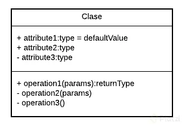
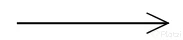
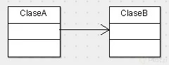
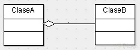
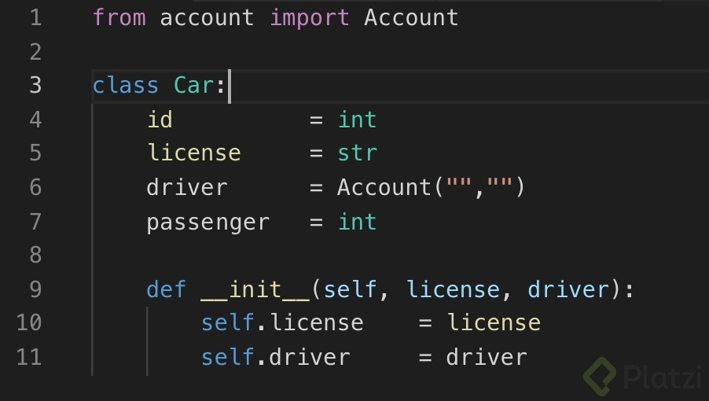
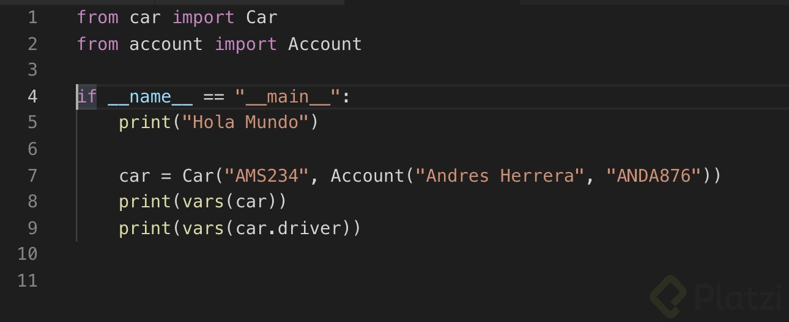
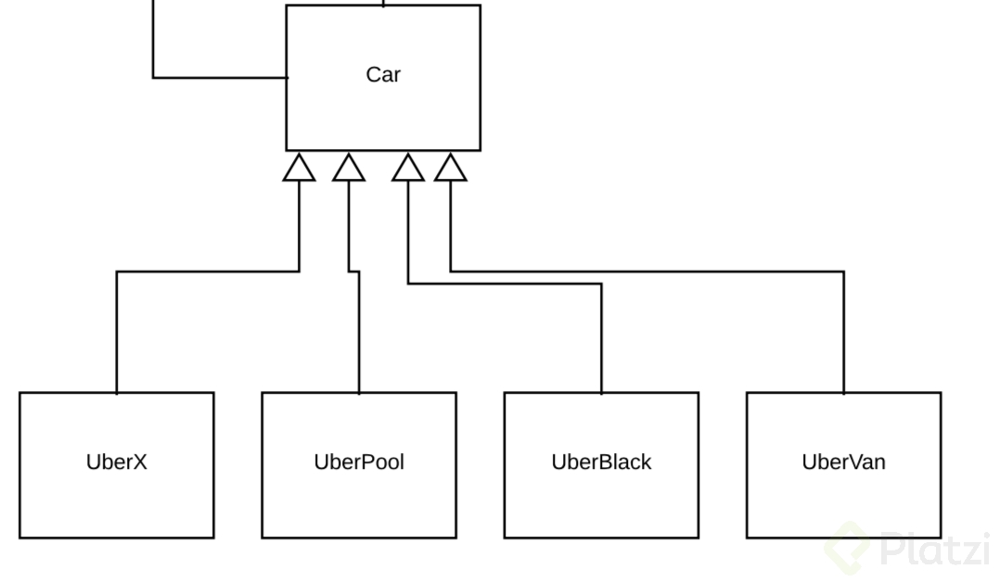

# Notas programacion orientada a objetos

**La programacion orientada a objetos** ayuda a programar mas rapido, ya que tener un analisis previo ayuda a generar codigo mas rapido.

La programacion orientada a objetos posee 4 conceptos fundamentales:

* **Encapsulamiento** : Quiere decir que oculta datos mediante codigo.
* **Abstracción** : Es la forma en la que se pueden representar objetos en código.
* **Herencia** : Es donde una clase nueva se crea a partir de una clase existente.
* **Polismorfismo** : Se refiere a la propiedad por la que es posible enviar mensajes sintácticamente iguales a objetos de tipos distintos.

## ¿Que resuelve la POO?

La programación orientada a objetos ayuda a resolver muchas de las debilidades de la programación estructurada. Ayuda a resolver el problema del código demasiado largo el cual traia problemas adicionales ya que era muy difícil de mantener.
La **POO** viene de una forma de pensar, la cual surge a partir de los problemas que tenemos y necesitamos plasmar en código. Se analizan los problemas en forma de objetos para posteriormente llevarlo a una solucion de codigo. La **POO** es un **paradigma**.
Un **paradigma** es una teoría que suministra la base y el modelo para resolver problemas.
**El paradigma de programacion orientada a objetos** se compone de 4 elemntos:

* **Clases** :
* **Propiedades** :
* **Métodos** :
* **Objetos** :

## Lenguajes orientados a objetos

Hay muchos lenguajes orientados a objetos como **java**, **python**, **javascript**, **php**. **ruby**, **perl**, **c#**, etc.

**Java**

* Orientado a objetos naturalmente.
* Android.
* Server Side.

**.java**

**PHP**

* Lenguaje interpretado.
* Pensado para la Web.

**.php**

**Python**

* Diseñado para ser fácil de usar.
* Múltiples usos: Wev, Server Side, Analisis de Datos, Machine Learning,etc.

**.py**

**JavaScript**

* Lenguaje interpretado.
* Orientado a Objetos pero basado en prototipos
* Pensado para la Web.

**.js**

## Diagramas de Modelado

**OMT** y **UML**

**OMT**(1991) (Object Modeling Techniques). Es una metodología para el análisis orientado a objetos. La tecnica consiste en que una vez ya identificados los objetos, sus atributos, sus metodos y sus nombres, se plasme el objeto en un recuadro con todos los atributos y los metodos, y con una serie de conectores empezemos a definir las relaciones que tiene un objeto con otro.

**UML**(1997) Unified Modeling Languaje

* Clases
* Casos de uso
* Objetos
* Actividades
* Iteranción
* Estados
* Implementación

Es la vercion mejorada de OMT.



En la parte superior del recuadro se colocan los atributos o propiedades, y debajo las operaciones de la clase. El primer caracter con el que empiezan es un símbolo. Este denotará la visibilidad del atributo o método, esto es un término que tiene que ver con Encapsulamiento.

Estos son los niveles de visibilidad que puedes tener:

//- private
//+ public
//# protected
//~ default,

Una forma de representar las relaciones que tendrá un elemento con otro es a través de las flechas en UML.



Como su nombre lo dice, notarás que cada vez que esté referenciada este tipo de flecha significará que ese elemento contiene al otro en su definición. La flecha apuntará hacia la dependencia.



Con esto vemos que la ClaseA está asociada y depende de la ClaseB.

Herencia

.png)

Siempre que veamos este tipo de flecha se estará expresando la herencia.
La dirección de la flecha irá desde el hijo hasta el padre.


Con esto vemos que la ClaseB hereda de la ClaseA

Agregación


Este se parece a la asociación en que un elemento dependerá del otro, pero en este caso será: Un elemento dependerá de muchos otros. Aquí tomamos como referencia la multiplicidad del elemento. Lo que comúnmente conocerías en Bases de Datos como Relaciones uno a muchos.



Con esto decimos que la ClaseA contiene varios elementos de la ClaseB. Estos últimos son comúnmente representados con listas o colecciones de datos.

Composición


Este es similar al anterior solo que su relación es totalmente compenetrada de tal modo que conceptualmente una de estas clases no podría vivir si no existiera la otra.


Cuando tengamos un problema lo primero que debemos hacer es **identificar objetos**.

Los **Objetos** son aquellos que tienen propiedades y comportamientos, pueden ser fisicos o conceptuales.

Los objetos siempre tienen un sustantivo por nombre, manzana, cama, computadora,etc.

Las **propiedades** también pueden llamarse atributos y tambien seran sustantivos.

EJ:

* nombre
* tamaño
* forma
* estado

Basicamente todo lo que compone las caracteristicas de ese objeto, esos son los atributos.

Los **comportamientos** serán todas las operaciones del objeto, suelen ser verbos o sustantivo y verbo.

EJ:

* login().
* logout().
* mekeReport().

### Objeto Perro

#### Atributos:

// + nombre

// + color

// + raza

// + altura

#### Comportamientos

// + ladrar

// + comer

// + dormir

// + correr

Por ejemplo en un catalogo de adopcion de perros:

#### Propiedades

// + id

// + nombre

// + color

// + raza

// + altura

#### Comportamientos

// + serAdoptado()

## Clases

Una clase es el modelo sobre el cual se contruirá nuestro objeto, las clases permitirán generar más objetos.

**Se analizan los objetos extrayendo de ellos sus propiedades y metodos, y con ellos se generan modelos, esos modelos se llaman clases**.

El analisis se llama **Abstraccion**.

### Modularidad

La **modularidad** es uno de los principios de la POO y va muy de la mano con el diseño modular, el diseño modular viene de la arquitectura modular, lo que significa subdividir un sistema en partes mas pequeñas, estas partes mas pequeñas se llaman **modulos**, estos modulos pueden funcionar de manera idependiente y ayudan a componer un sistema completo organizado en modulos.

El diseño modular Orientado a Objetos nos permite reutilizar, evitar colapsos, es mas mantenible, mas legible, resolucion rápida de problemas.

Las **clases** son las que permiten dar modularidad al codigo, dividen los programas en diferentes partes o módulos/clases y separa las clases en archivos.

**Las clases tienen una identidad, nombre, un estado, atributos, y un comportamiento, metodos.**

### Don't Repeat yourself

Promueve la reduccion de duplicacion en programacion

Toda pieza de informacion nunca deberia ser duplicada debido a que la duplicacion incrementa la dificultad en los cambios y evolucion.

## Herencia

La **herencia** permite crear nuevas clases a partir de otras, cuando haya una duplucidad se debe pensar en una abstraccion de tal manera que podamos generar una clases la cual sea mas general entre esas y esa clase mas general nos permita crear nuevas clases.

En la **herencia** se establece una relacion de padre e hijo, un padre puede tener muchos hijos, no solamente uno. La clase padre, en POO se conoce como **superclase**, y las clase hijas seran las **subclases**.

## Objetos

Los **objetos** son instancias de una clase, el objeto es el resultado de lo que se modela en una clase.

JAVA

``` java
Person person = new Person();
```

PYTHON

```python
person = Person()
```

JAVASCRIPT

```javascript
var person = new Person();
```

PHP

```php
$person = new Person();
```

## Metodo constructor

El metodo constructor da un estado inicial al objeto y tiene el mismo nobre de la clase. Son los parametros minimos que necesita el objeto para que pueda vivir.

JAVA

```java
public Person(String name) {
    this.name = name;
}
```

PYTHON

```python
def__init__(self,name):
    self.name = name
```

JAVASCRIPT

```javascript
function Person(name) {
    this.name
}
```

PHP

```php
public function__construct($name) {
    $this->name = name;
}
```

En Python encontrarás un concepto denominado Métodos Mágicos, estos métodos son llamados automáticamente y estrictamente bajo ciertas reglas. El método constructor en Python forma parte de esta familia de métodos y como aprendimos en la clase anterior lo declaramos usando __init__, aunque si nos ponemos estrictos este método no construye el objeto en sí. El encargado de hacer esto es __new__ y el método __init__ se encargará de personalizar la instanciación de la clase, esto significa que lo que esté dentro de __init__ será lo primero que se ejecute cuando se cree un objeto de esta clase.

Para nuestro proyecto tenemos la necesidad de que algunas variables se inicialicen obligatoriamente cuando ocurra la instanciación. Así que declaremos el método __init__ en las clases de nuestro proyecto con las propiedades obligatorias.

Para la clase Account quedaría algo así, notarás que usamos la palabra clave self, esta es muy parecida a lo que venimos trabajando a otros lenguajes con this. Y como su nombre lo dice hace referencia a los datos que componen la clase, en este caso self.name está llamando al atributo name que se encuentra en la línea 3 de la clase y, le está asignando el dato que se pasa en el método __init__ de la línea 8.


Ahora veamos la clase Car:



Lo que notarás de diferente es que cambiamos el tipo de dato de driver, ahora es de tipo Account y como ves está solicitando los dos datos obligatorios para instanciar un objeto de este tipo. Esto lo verás más en acción en el próximo fragmento de código del archivo main.py. Además, mucho ojo, en la primera línea observamos que es importante importar la clase para poderla usar.

Nuestro archivo main.py ahora se verá así:



## HERENCIA

Java:

```java
class Student extends Person
```

Python:

```python
class Student(Person):
```

JavaScript:

```javascript
student.prototype = new Person();
```

PHP:

```php
class Student extends Person
```

Casi siempre se dice en herencia que una **clase** extiende de otra.

## OTROS TIPOS DE HERENCIA

A partir de ahora las clases que estén siendo heredades las llamaremos familias.

Acabamos de aplicar herencia a la familia Car. Ahora apliquémosla a la familia Payment.

En clases anteriores te mencioné que otro punto de partida que puedes tomar para aplicar herencia es del hecho de que hay clases que lógicamente deberían estar en una familia, como es el caso de Payment.

Repasemos el diagrama de Payment


Notarás que a nivel de código parece inservible pero cuando estemos en el caso de uso Pagar un Viaje, probablemente en ese momento no sabremos cuál es el método de pago, y necesitemos ingresar un dato lo suficientemente genérico que conceptualmente nos dé la información que necesitamos, en este caso que es un Payment. Este es un tipo de Polimorfismo y uno de los principios SOLID del software que obedece a la Inyección de Dependencias. Lo veremos más adelante a detalle.

Ahora nos faltará crear las clases y aplicar su herencia.

## ENCAPSULAMIENTO

El encapsulamiento es hacer que un dato sea inviolable, inalterable cuando se le asigne un modificador de acceso (no se trata solo de ocultar el dato sino también de protegerlo). Un modificador de acceso define el alcance y visibilidad de un miembro de clase.
La encapsulacion es también llamada ocultamiento de información.

Algunos beneficios de encapsulación son:

* Controlar la manera en que los datos son accedidos o modificados
* El código es mas flexible y fácil de cambiar a partir de nuevos requerimientos
* Poder modificar una parte del código sin afectar otras partes del mismo
* Ayuda a mantener la integridad de los datos

### Modificadores de acceso

* Public: Es el mas permisivo de todos, Accede a todo.
* Protected: Podrá ser accedido por la clase, paquetes y subclases.
* Default: Permite el acceso a nivel de clses de internas y paquetes (No podremos ver las herencias si ha detener (Osea subclases))
* Private: Solo podrá ser modificado dentro de la clase.

Se puede encapsular: elementos o atributos, clases o incluso métodos; El encapsulamiento nos permite tener dicho elemento inalterable en la POO.

## Getters y Setters

Son metodos que nos permiten acceder a los datos del atributo

### Getters y Setters Python

En python no existen como tal las variables privadas, pero se pueden “esconder” o volver privadas con solo colocarle doble guion bajo al nombre de la variable.

```python
def setPassenger(self,passengerNum):
        if passengerNum >= 4:
            self.__passenger = int(passengerNum)
            print("Passengers asgindados : " + str(self.__passenger))

        else:
            print("El número de pasajeros es demasiado bajo para esta categoría")

    def getPassenger(self):
        if self.__passenger != int:
            print(self.__passenger)```
```

## POLIMORFISMO

Significa muchas formas. Es donde tenemos un metodo que se comparte entre muchas clases y cada clase le da el comportamiento que ella necesita.

* Muchas formas.
* Construir métodos con el mismo nombre pero con comportamiento diferente.

Cuando se sobreescribe un metodo se esta aplicando polimorfismo.

En resumen el pilomorfismo es cambiar la estructura o cambiar el comportamiento de un metodo que proviene de una clase padre.

## EL DIAGRAMA UML DE UBER

Este es el diagrama que finalmente obtuvimos, aquí solo faltaría añadirle los atributos que posee cada clase.


En nuestro diagrama tuvimos al menos tres familias conviviendo. La dirección de la flecha irá desde el hijo hasta el padre.

## HERENCIA

### FAMILIA CAR



### FAMILIA ACCOUNT


### FAMILIA PAYMENT


## COMPOSICION

Pasemos a una de nuestras piezas claves, pues notarás en el centro del diagrama la clase Trip que está vinculada a User, Car, Route y Payment. La composición va a significar una asociación entre estas clases con la diferencia de que para que esta clase pueda vivir forzosamente necesita a las demás. Es decir que estas clases son obligatorias para que la clase Trip pueda existir, esta dependencia obligatoria podríamos expresarla en el método constructor de la clase Trip, pues para que un objeto pueda ser creado dependerá de que los demás existan.


Esta clase Trip poseerá la lógica más fuerte del negocio aquí será donde se concentrarán la mayor cantidad de clases.