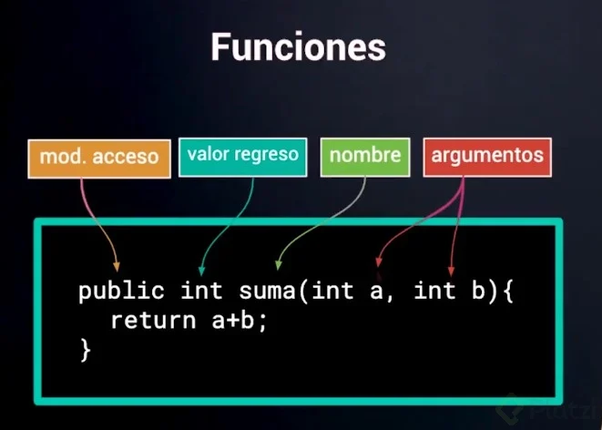
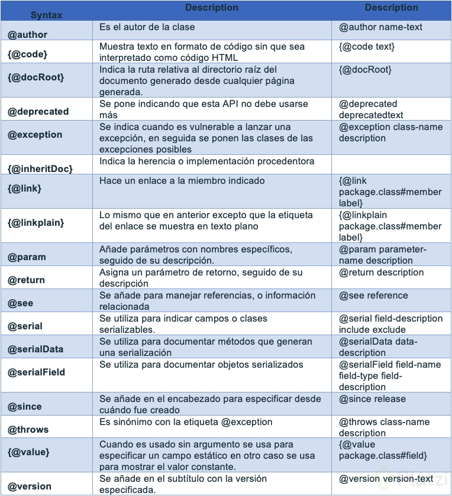

# Notas JavaSE (Standar Edition)

Hola Mundo De Java

```java
public class HolaMundo {
    Sytem.out.println("Hola mundo!!");
}
```

Java es un lenguaje de programacion creado en 1991 por James Gosling.

El metodo **main** es el punto de entrada de una aplicacion Java.

Un metodo **main** en **Java** se ve asi:

```java
public  static void main (String[] args) {
    //acciones
}
```

Los archivos **.java** se compilan (comando **javac** en la terminal) en **ByteCode** (los archivos **.class**) los cuales son ejecutados en la **JVM** (Java Virtual Machine).

Editar > Compilar > Cargar > Verificar > Interpretar

Escribir codigo fuente  > Compilador javac  > Ejecución.

**Java** es **Compilado** e **Intepretado**.

-------------------------------------------------------

## Variable

Las **variables** son un espacio de memoria  al que le asignamos un contenido.

- Las variables siempre deben ser inicializadas.

- Los nombres de las variables deben ser unicos.

- Los datos de las variables pueden ser de tipo numerico o de tipo texto.

Las variables no solo pueden ser definidas y asignadas sino que tambien pueden ser alteradas.

Para concatenar texto se usa el token **+**.

-------------------------------------------------------

## Convencion de nombre en Java

Java es sensible mayúsculas  y minúsculas, tambien todas nuestras variables deben comenzar con una letra, $ o "_".

-------------------------------------------------------

## Constante

Una constante es una variable cuyo valor no puede cambiar, como PI, este tipo de dato debe ser escrito en mayusculas, si esta compuesto de dos palabras estas deberan ser separadas por un guion bajo.

### Tecnica de Naming: Camel Case

Upper Camel Case

Lower Camel Case

Cuando la primera letra de la variable es mayuscula y las Iniciales de cada palabra tambien es UpperCamelCase.

En LowerCamelCase la primera letra es minuscula.

Se utiliza UpperCamelCase cuando estemos nombrando clases, todos los nombres de las clases van a comenzar con mayusculas.
LoweCamelCase se usa para los nombres de las variables, incluso nombres de metodos.

-------------------------------------------------------

## Data Types

### Enteros

* **byte (1 byte)** : Rango -128 a 127.
  
* **short (2 bytes)** : -32,768 a 32,767.
  
* **int (4 bytes)** : Rango -2,147,483,684 a 2,147,483,647.

* **long (8 bytes)** : Rango -9,223,372,036,854,775,808 a 9,223,372,036,854,775,807.


Para los tipos de datos **long** se debe poner una "L" al final del dato para que el compilador lo reconozca como un dato de tipo **long**.

-------------------------------------------------------

### Punto Flotante

* **float (4 bytes)** : Rango 1.40129846432481707e-45 a 3.40282346638528860e+38.
* **double (8 bytes)** : Rango 4.94065645841246544e-324d a 1.79769313486231570e+308d.

-------------------------------------------------------

### Tipo de daro Char y Boolean

#### Texto

* **char (2 bytes)** : Rango Unicode.

para char solamente se usa comillas simples.

#### Logicos

* **boolean (2 bytes)** : Rango true o false.

A partir de **java 10** se puede ignorar poner el tipo de dato de la variable y reemplazarlo por la parabra clave **var**. Con esto java va a inferir el tipo de dato de la variable.

-------------------------------------------------------

## Operadores de asignación, incremento y decremento

### Operadores de asiganación

| Operador | Aplicación | Desglose  |
| :------: | :--------: | :------:  |
| +=       | a += b     | a = a + b |
| -=       | a += b     | a = a - b |
| *=       | a *= b     | a = a * b |
| /=       | a /= b     | a = a / b |
| %=       | a %= b     | a = a % b |

-------------------------------------------------------

### Operador Incremento Decremento


| Operador | Nombre     | Ejemplo | Desglose  |
| :------: | :----:     | :-----: | :------:  |
| ++       | incremento | i++     | i = i + 1 |
| --       | decremento | i--     | i = i - 1 |

-------------------------------------------------------

Para utilizar postfijo (variable++) primero se accede al dato y se hace la operacion que se tenga que hacer.

En el caso de prefijo (++variable) se obtiene el dato ya incrementado.

-------------------------------------------------------

## Operaciones matemáticas

Las operaciones matematicas en Java se usan accediendo al metodo **Math**.

-------------------------------------------------------

### Cast

En la programacion hay situaciones donde se necesita  cambiar  el tipo de dato. Se debe tener en cuenta si se quiere tener estimacion o exactitud.

```java
double d = 86.45;
int i = (int) d;
```

### Overflow y Underflow

Algo muy importante a considerar al realizar un casting entre variables es que puede alterarse el valor de la misma si excede el máximo o mínimo soportado por el tipo de dato a convertir.
Por ejemplo:

```java
short y = (short)1921222; //Almacena 20678
```

El valor 1921222 es demasiado grande para almacenarse como un short, por lo que se produce un desbordamiento (overflow) numérico y se convierte en 20678.
El overflow es cuando un numero es tan grande que ya no cabe dentro del tipo de dato, por lo que Java lo ajusta al siguiente valor mas bajo y cuenta desde allí.

-------------------------------------------------------

Es importante que la maquina **JVM** en produccion sea igual o mayor a la version en la que se compilo el proyecto.

-------------------------------------------------------

## Sentencia if

Las computadoreas tienen una forma de tomar decisiones, atravez de **valores booleanos**. Esto lo hacen atravez de un sentencia que se conoce como **if**, dentro de ese **if** se coloca la condicion. El resultado de la condicion siempre sera un resultado **booleano**.

IF

```java
if (condicion) {
    instrucciones;
}
```

-------------------------------------------------------

## Alcance/Scope

Existen dos tipos de declaracion para variables:

1. **Las variables globales**: Se definen antes de entrar a una funcion o proceso y que como su nombre indica pueden ser llamadas a procesos en cualquier lugar ya que fueron previamente declaradas. (USO PUBLICO PODRIA DECIRSE).

2. **Las variables locales**: Son las que se definen para un proceso en especifico en un funcion especifica y solo van a ser reconocidas para esa funcion o proceso, es decir que si intentamos hacer la llamada a una variable local en otra funcion que no sea la de origen no la reconocera como declarada.(USO PRIVATIZADO).

-------------------------------------------------------

## Else

Cuando la condicion dentro de un **if** no se cumple se ejecuta **else**.

```java
if (condicion) {
    instrucciones;
} else {
    instrucciones;
}
```

-------------------------------------------------------

## Operadores Lógicos y Expresiones booleanas

### Operadores de equidad

| Operador | Nombre      | Ejemplo  |
| :------: | :----:      | :-----:  |
| ==       | igualdad    | a == b   |
| !=       | desigualdad | a != b   |

-------------------------------------------------------

### Operadores relacionales

| Operador | Nombre            | Ejemplo  |
| :------: | :----:            | :------: |
| <        | Menor que         | a < b    |
| >        | Mayor que         | a > b    |
| <=       | Menor o igual que | a <= b   |
| >=       | Mayor o igual que | a >= b   |

-------------------------------------------------------

### Operadores lógicos

| Operador | Nombre | Ejemplo |
| :------: | :----: | :-----: |
| &&       | AND    | a && b  |
| !        | NOT    | !a      |

Y el operador( || OR (a || b)).

-------------------------------------------------------

#### AND

| a | b |a && b|
|:-:|:-:|:-:|
|f|f|f|
|f|v|f|
|v|f|f|
|v|v|v|

-------------------------------------------------------

#### OR

|a|b|a OR b|
|:-:|:-:|:-:|
|f|f|f|
|f|v|v|
|v|f|v|
|v|v|v|

-------------------------------------------------------

#### NOT

|a|!a |
|:-:|:-:|
|f|v|
|v|f|

-------------------------------------------------------

## IF/ ELSE IF

```java
if (condición) {
    instrucciones;
} else if (condición) {
    instrucciones;
} else {
    instrucciones;
}
```

Esta sentencia la usamos cuando queremos evaluar alguna condición diferente del **if** pero no exactamente al revés.

```java
if (noHayInternet) {
    System.out.println("No hay internet");
} else if (hayInternetPeroMuyPoquito) {
    System.out.println("Tienes muy poquito internet");
} else if (hayBuenInternetPeroNoEsSuficiente) {
    System.out.println("Casi casi, falta solo un poquito más");
} else {
    System.out.println("¡Tienes suficiente internet!");
}
```

-------------------------------------------------------

## Sentencia Switch

La sentencia **Switch** nos ayuda a tomar decisiones con base a una o más condiciones, pero funciona un poco diferente.

```java
switch (a) {
    case valor1:
        break;
    case valor2:
        break;
    default:
        break;
}
```

A partie de **Java 12** el **Switch** es asi:

```java
switch (a) {
    case valor1 -> ;
    case valor2 -> ;
    case valor3 -> ;
    case valor4 -> ;
    default -> "N/A";
};
```

La sentencia **Switch** solo admite los tipos de datos:

- byte y Byte
- short y Short
- int y Integer
- char y Character
- String
- enum

No admite:

- boolean y Boolean
- long y Long
- float y Float
- double y Double

-------------------------------------------------------

## Funciones

Las funciones nos ayudan a ejecutar código que dependiendo de las opciones que le enviemos, transformará y devolverá un cierto resultado. Gracias a las funciones podemos organizar, modularizar, reutilizar y evitar repetidos en nuestro código.

Todas nuestras funciones deben tener un nombre. Opcionalmente, pueden recibir argumentos y devolver un resultado. También debemos especificar el tipo de dato de nuestros argumentos y el resultado final de nuestra función.

Por ejemplo:

```java
public int suma (int a, int b) {
  return a + b;
}
```

Si nuestra función NO devuelve ningún tipo de dato podemos usar la palabra reservada **void**.

Para utilizar nuestras funciones solo debemos asignar el resultado de la función y sus parámetros a una variable con el mismo tipo de dato de la función:

```java
int c = suma(5, 7);
```

- Return: palabra clave cuando una función tiene un valor de regreso.
- Void: palabra clave cuando una función no tiene un valor de regreso.

**Nota**: si nuestras funciones van a devolver argumentos, lo mejor es que especifiques el tipo de dato que serán. Para utilizar nuestras funciones solo debemos asignar el resultado de la función y sus parámetros a una variable con el mismo tipo de dato de la función.



- Los nombres de las funciones deben ser unicos.

- Las funciones deben vivir al nivel de la clase.

-------------------------------------------------------

## Java Docs

Los Java Docs son una herramienta usada por muchas otras herramientas y aplicaciones porque nos ayuda a documentar todo nuestro código usando comentarios. Además, nos permite visualizar la documentación en formato HTML.

```java
// Comentarios de una sola línea

/* Comentario
* en múltiples
* líneas */

/**
* Comentario para Java Docs
* */
```

- Nos ayuda a comprender qué hace el codigo.
- Genera documentación en HTML.

### JavaDocs en funciones

Se puede generar documentación de las funciones con JavaDoc la cual puede ser mostrada por el editor.

```java
/**
 * Descripción general de nuestra función.
 *
 * @param quantity Descripción del parámetro quanity.
 * @param currency Descripción del parámetro currency (MXN o COP).
 * @return Descripción del valor que devolvemos en esta función.
 * */
```

Para activar la visibilidad de la documentación en Windows:
.
File > Settings > Editor > General > Code Completion y pasas a activar la opción "Show the documentation popup in 1000 ms" y por ultimo le das a OK.

### Tags Java Docs



-------------------------------------------------------

## Bucles

### Bucle do While

Los bucles (ciclos) nos ayudan a ejecutar una parte de nuestro código una cantidad de veces hasta que se cumpla alguna condición y podamos continuar con la ejecución de nuestro código.

Existen diferentes bucles. Por ejemplo, el bucle do while:

```java
do {
  // instrucciones
} while (condición);
```

Bucle while

```java
while (condicion) {
    //instrucciones
}
```

Los ciclos evaluarán si la condición se cumple y cuando deje de hacerlo no ejecutarán más el código del ciclo. Las instrucciones son las encargadas de que esta condición cambie de verdadero a falso. De otra forma, si las instrucciones nunca cambian la condición, el ciclo no se detendrá nunca, lo que conocemos como un ciclo infinito.


La diferencia entre **while** y **do while** es que en **while** jamas va a entrar en el **ciclo** hasta que se cumpla la condicion y en **do while** va a entrar al **ciclo** y luego va a evaluar la condicion, si se cumple puede entrar al **ciclo** por segunda vez pero si no se cumple al menos entro una sola vez.

-------------------------------------------------------

### Scanner

La clase Scanner le permite a los usuarios contestar algunas preguntas para que nuestro programa actúe de una forma u otra. Para usarla solo debemos importar la clase Scanner de las APIs de desarrollo de Java.

```java
import java.util.Scanner;

int response = 0;

Scanner sc = new Scanner(System.in);
response = Integer.valueOf(sc.nextLine());

```

-------------------------------------------------------

## Bucle While

El Bucle While nos ayuda a ejecutar una parte del código mientras una condición se cumpla. Recuerda tener mucho cuidado y asegurarte de que la condición del ciclo while cambie en algún momento, de otra forma, el ciclo no se detendrá nunca y sobrecargarás tu programa:

```java
while (isTurnOnLight) {
  printSOS();
}
```

-------------------------------------------------------

## Operador Ternario

Los operadores ternarios son otra forma de evaluar condiciones, así como los condicionales IF y ELSE:

```java
// Operador Ternario:
isTurnOnLight = (isTurnOnLight) ? false : true;

// IF y ELSE:
if (isTurnOnLight) {
  isTurnOnLight = false;
} else {
  isTurnOnLight = true;  
}
```

-------------------------------------------------------

## Bucle For

El **Ciclo For** nos ayuda a ejecutar una parte de nuestro código las veces que sean necesarias para que se cumpla una condición. De hecho, el ciclo FOR nos da muchas ayudas para lograr este resultado de la forma más fácil posible:

```java
// Estructura:
for (inicialización; condición; incremento o decremento;) {
  // Instrucciones
}

// En este ejemplo el mensaje de printSOS se
// ejecutará 10 veces:
for (int i = 1; i <= 10; i++) {
  printSOS();
}
```

Ej:

```java
for(int i = 5; i >= 0; i--){
    for(int j = 0; j <= i; j++){
        System.out.print("*");
    }
    System.out.print("\n");
}
```

Output

```java
******
*****
****
***
**
*
```

-------------------------------------------------------

## Break, Continue y Return

### Break

-------------------------------------------------------

En Java esta sentencia la verás en dos situaciones especificamente:

1. En un Switch: en esta situación break hace que el flujo del switch no continúe ejecutándose a la siguiente comparación, esto con el objetivo de que solo se cumpla una sola condición:

```java
switch (colorModeSelected){
    case "Light":
                System.out.println("Seleccionaste Light Mode");
                break;
        case "Night": //Ambar
                System.out.println("Seleccionaste Night Mode");
                break;
        case "Blue Dark":
                System.out.println("Seleccionaste Blue Dark Mode");
                break;
}
```

2. Para salir de un bucle: Como acabamos de ver un break es capaz de detener el flujo en el código, en este caso detendremos el ciclo como tal terminándolo y haciendo que saltemos a la siguiente instrucción después del ciclo.

### Continue

-------------------------------------------------------

Continue en cierto modo también nos va a servir para detener un ciclo pero en lugar de terminarlo como en el caso de break, este volverá directo a la condición.

### Return

-------------------------------------------------------

Aunque en algunos lenguajes esta sentencia sirve como un tipo goto, dónde se rompe el flujo del programa la mejor forma de usarlo en Java es en Funciones, cuando lo usamos aquí siempre viene acompañado de un valor, el cuál indica el dato que se estará devolviendo en la función.

-------------------------------------------------------

## Arrays

**Los arreglos o arrays** son objetos en los que podemos guardar más de una variable, una lista de elementos. Los arrays son de una sola dimensión, pero si guardamos arrays dentro de otros arrays podemos obtener arrays multidimensionales.

Los arrays se definen en código de las siguientes maneras:

```java
// 1. Definir el nombre de la variable y el tipo de datos
//  que va a contener, cualquiera de las siguientes dos
// opciones es válida:
TipoDato[] nombreVariable;
TipoDato nombreVariable[];

// 2. Definir el tamaño del array, la cantidad de elementos
// que podemos guardar en el array:
TipoDato[] nombreVariable = new TipoDato[capacidad];

// Array de dos dimensiones:
TipoDato[][] cities = new String[númeroFilas][númeroColumnas];
```

Ya que los arrays pueden guardar multiples elementos, la convención es escribir los nombres de las variables en plural.

Una forma de declarar una array sin limite de tamaño:

```java
import java.util.ArrayList;
import java.util.List;

public class ArraysTest {
    publicstaticvoid main(String[] args) {
        List<String> Days = new ArrayList<>();
        Days.add("Monday");
        Days.add("Tuesday");

        Days.forEach((n) -> System.out.println(n));
    }
}
```

No confundir uno es Array y el otro es un ArrayList

- Array => Tamaño definido
- ArrayList => Tamaño dinámico

-------------------------------------------------------

### Indices y búsqueda de elementos en Arrays

Los índices son variables simples que nos ayudan a identificar las posiciones en un arreglo. Estas variables siempre guardan números, comienzan en 0 e incrementan de abajo a arriba y de izquierda a derecha a medida que guardamos más elementos en nuestros arrays.

Para guardar un valor en alguna posición de nuestro array solo debemos usar el índice de la siguiente forma:

```java
nombreVariable[indice] = valor;

//Ej
String[][][][] chango = new String[2][3][2][2];
chango[1][0][0][1] = "Changuito";
System.out.println(chango[1][0][0][1]);
```

**Los arrays se leen de izquierda a derecha y de abajo a arriba**.

*Primer reglon, primera columna, primera paguina ([0][0][0])*.

No es tan comun ver **arrays** de mas de tres dimensiones, sin embargo estas suelen ser usadas en matematicas.

-------------------------------------------------------

## Ciclos For Anidados

Los ciclos FOR nos ayudan a ejecutar una parte de nuestro código todas las veces que sean necesarias hasta que una condición se cumpla, por ejemplo, que un número supere o iguale cierta cantidad.

Eso es exactamente lo que necesitamos para trabajar con índices. En vez de escribir todos los números a mano, vamos a utilizar un ciclo para imprimir el valor de cada posición de nuestros arreglos, incluso si estos son multidimensionales:

```java
// Array de una sola dimensión:
for (int i = 0; i <= 3; i++) {
  System.out.println(i);
}
// El resultado será: 0, 1, 2, 3

// Array de dos dimensiones:
for (int row = 0; row < cities.length; row++) {
  for (int col = 0; col < cities[row].length; col++) {
    System.out.println(cities[row][col]);
  }
}
// El resultado será:
// Colombia
// Bogotá
// México
// Guadalajara
// España
// Madrid
```

La inicializacion de una **array** de tipo **String** va a ser **null** y una de tipo **int** va a ser 0.

### Foreach

El ciclo FOREACH también nos ayuda a recorrer los elementos de un array posición por posición, solo que no tenemos control sobre el índice, el ciclo se encarga de recorrer todo el array automáticamente:

```java
for (TipoDato elemento : coleccion) {
  // Instrucciones
}
```
